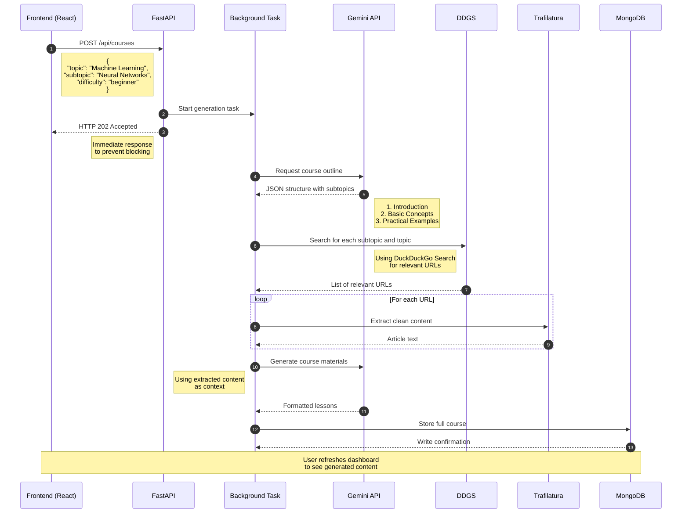

# Course Gen - Personalized Learning Course Generator

A web application that curates content from various sources to create personalized learning courses.

## Tech Stack

- **Frontend**: Vite + React.js (with Tailwind CSS)
- **Backend**: FastAPI
- **Database**: MongoDB
- **APIs & Libraries**:
  - Gemini API (course design)
  - DuckDuckGo Search (DDGS) (web search)
  - Trafilatura (content extraction)

## FastAPI Workflow

The backend follows an asynchronous workflow to generate course content without making users wait.

### ⚙️ FastAPI Backend Flow (Sequence Diagram)


## Key Features

###  Asynchronous Processing
- **Non-blocking UI**: Course generation happens in the background, keeping your interface responsive
- **Scalable architecture**: Handles multiple concurrent requests efficiently
- **Instant feedback**: Users receive immediate confirmation (HTTP 202) while processing continues

###  Smart Content Curation
- **Fresh materials**: Web search (DDGS) ensures up-to-date content
- **AI-powered structure**: Gemini API creates logical learning paths
- **Clean content**: Trafilatura extracts readable text from web pages
- **Personalized**: Tailored to each user's topic, subtopic and difficulty level

###  Performance Optimized
- **FastAPI backend**: Leverages Python's async capabilities
- **Quick database**: MongoDB provides fast storage/retrieval
- **Efficient pipeline**: Parallel processing where possible
- **Lightweight**: Minimal dependencies for faster execution

## Setup Instructions

### Backend Setup
```bash
# Navigate to backend directory
cd backend

# Create virtual environment
python -m venv venv

# Activate environment (Linux/Mac)
source venv/bin/activate

# Windows activation
# venv\Scripts\activate

# Install dependencies
pip install -r requirements.txt

# Start development server
uvicorn main:app --port=4000 --reload 
```

### Frontend Setup
```bash
# Navigate to frontend directory
cd frontend

# Install dependencies
npm install

# Start development server
npm run dev
```

#### Environment Variables

>**backend/.env:**
```dotenv
# Environment variables for FastAPI backend
MONGODB_URI=mongodb://localhost:27017
GEMINI_API_KEY=your_key_here
SECRET_KEY=your_secret_key_here # Used for JWT signing

```